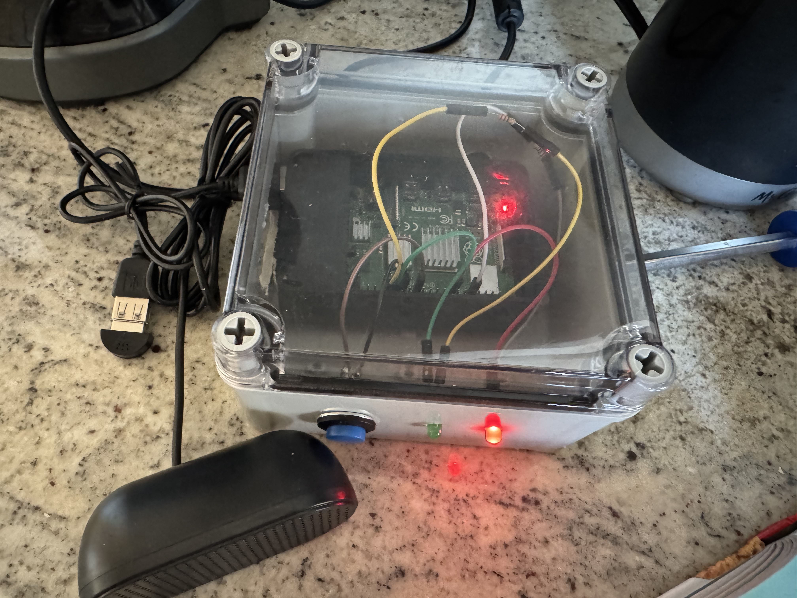

# Talkis



This is a toy I made for my son and a couple of his friends. The idea was a can-on-a-string to your neighbor's house, or a walkie talkie, but over WiFi with Tailscale for encryption. It's installed as a systemd service and runs on boot. You plug it in, and once Linux boots, the red LED turns on to signify that the Talkis service is running but not connected to a peer. When the other device is on, they will find each other over Tailscale with a UDP heartbeat and the lights will turn green for as long as they're connected. When the button is held down, audio will be written over another UDP socket, and you can talk into the mic and be heard on the other end. I think it should work with more than 2 units but haven't tested yet.

## To make one
- Install [Go](https://go.dev/doc/install).
- Install PortAudio: `apt install portaudio19-dev`.
- Install Tailscale (and make an account if you don't have one):
```
curl -fsSL https://tailscale.com/install.sh | sh
sudo tailscale up
```
- In the Tailscale control panel, tag the Raspberry Pi devices and set the rules to use the tag so that they can't call the rest of your network, but allow the rest of the network to call into them (to be able to manage over ssh).
- Disable key expiry in the Tailscale console (so they don't stop working in 6 months).
- Enable ssh with `sudo systemd enable ssh; sudo systemd start ssh`.
- Run `install.sh` to build, install, and start the service at boot.
- Use `nmtui` to configure a WiFi network before installing in a remote location.

## Hardware per unit

- Raspberry Pi 4 Model B (or similar, it probably works on others) and case.
- 32GB microSD card.
- A couple 220 ohm resistors.
- Some kind of electronics project enclosure (the one I used was 5"x5"x3").
- Arcade-like push buttons.
- Mini USB speaker.
- Mini USB microphone.
- Red and green LEDs.
- Female GPIO jumpers.
- 5V 3A USB-C power supply (with on/off switch so parents can turn off easily)
- Velcro strips to hold Raspberry Pi in place in the enclosure, and to hold the speaker and microphone in place. Hot glue could also be used.

## Tools I used

- Wire stripper
- Drill
- Dremel tool
- Soldering iron (to connect stripped wires to buttons)
- Screwdriver

 

## Notes to self

Find peer IPs: 
```
tailscale status | grep -oP '\d{1,3}\.\d{1,3}\.\d{1,3}\.\d{1,3}'
tailscale status | grep -oE '[0-9]{1,3}\.[0-9]{1,3}\.[0-9]{1,3}\.[0-9]{1,3}'
tailscale status | awk '{print $1}'
tailscale status | cut -d ' ' -f 1
```

Detect physical microphone:
```
pactl list short sources | grep -v monitor
```

Tailscale rule:
```
{
	"grants": [
		{
			"src": ["tag:talkis"],
			"dst": ["tag:talkis"],
			"ip":  ["*"],
		},
		{
			"src": ["autogroup:member"],
			"dst": ["autogroup:member"],
			"ip":  ["*"],
		},
		{
			"src": ["autogroup:member"],
			"dst": ["tag:talkis"],
			"ip":  ["*"],
		},
	],
	"tagOwners": {"tag:talkis": ["your@user.name"]},
}
```

## To Do
- Wiring diagram
- Confirm that it works with more than 2 units
- Disable audio output when the button is held to prevent feedback
